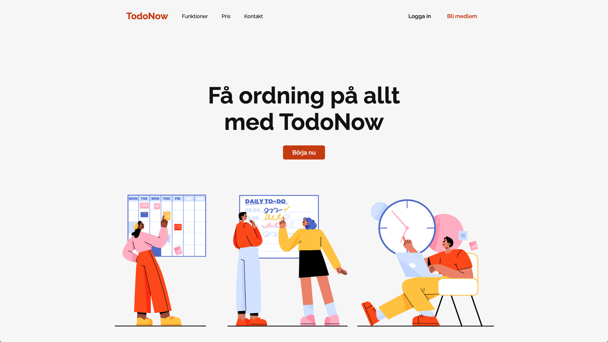

# TodoNow

En enkel landing page för en todo-tjänst.

## Live demo

[Öppna sidan](https://selmacodes.github.io/todo-now/)

## Tekniker

- HTML (semantisk markup)
- CSS (Flexbox, BEM, responsiv typografi med clamp())
- Google Fonts (Raleway)

## UX-principer

- **Visuell hierarki** - rubrik, CTA-knapp och bild presenteras i tydlig ordning.
- **Konsistens & BEM** - enhetliga färger, typografi och klasser ger förutsägbar struktur.
- **Tillgänglighet & läsbarhet** - alt-text på bild och tillräcklig kontrast.
- **Skalbarhet** - layout och typografi är flexibla med fokus på desktop.
- **Tydlig handling (CTA)** - knappen "Börja nu" är framträdande och lätta att hitat.
- **Minimalism** - hero-bild och rubrik kommunicerar syftet utan distraktioner.
- **Förutsägbarhet** - navigation och knappar på standardplatser för intuitiv användning.
